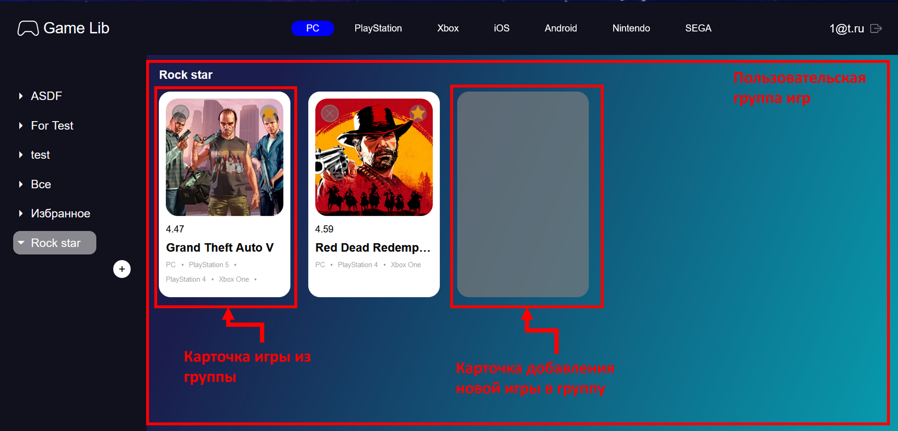

# Приложение: Библиотека игр

# Обзор:

Приложение позволяет игрокам искать, и группировать выбранные игры. В первую
очередь будет полезна для игроков, использующих разные игровые платформы. Также
приложение позволяет получать дополнительную информацию об играх: дата релиза,
поддерживаемые платформы, игры из той же серии, dlc, игровые достижения.

# Запуск приложения

```
yarn install
yarn run start
```

# Компоненты

1. Страницы
   1. Страница поиска игр – главная
      1. Строка поиска
      1. Поле результатов
   1. Страница игры
      1. Основная информация об игре
      1. Список скриншотов из игры и список внутриигровых достижений
      1. Список дополнений к игре и список игр из той же серии
      1. Комментарии пользователей об игре
      1. Блок добавления комментария
   1. Страница пользователя
      1. Список игр из группы пользователя
      1. Окно добавление игр в группу
1. Панели
   1. Верхняя
   1. Левая
1. Карточки:
   1. Карточка «результат поиска»
   1. Карточка «добавить в группу»
   1. Карточка «добавляемое в группу»
1. Окно аутентификации

***

## Страницы

1. Страница поиска игр – главная

Главная страница приложения, включает в себя строку поиска и поле результатов
поиска.


**Строка поиска**

Поиск будет выполняться среди игр платформы, которая задана в верхней панели (на рисунке это PC)

**Результаты поиска**

Результат поиска представлен набором карточек (Карточка «результат поиска»), в
которых содержится информация об играх.

Нажатие на карточку откроет страницу соответствующей игры.

2. Страница игры

Страница для игры содержит всю основную информацию об игре.


**Основная информация об игре**

Включает название, платформы, на которых игра представлена, главную картинку
игру и кнопку перехода в магазин. В качестве магазина будет выбран либо steam, либо первая из ссылок полученных от Rawg api.

**Список скриншотов из игры и список внутриигровых достижений**


Список скриншотов содержит горизонтальный скроллер со скриншотами игры. Список
внутриигровых достижений содержит горизонтальный скроллер с внутриигровыми
достижениями игры. При наведении на картинку достижения всплывет подсказка с
информацией об этом достижении. В подсказке указано название достижения и его описание.

**Список дополнений к игре и список игр из той же серии**


В данных блоках представлены галереи с играми/дополнениями, связанными с
рассматриваемой игрой. Нажатие на карточку откроет страницу с игрой.

**Комментарии пользователей об игре**


В каждом комментарии указан автор и сам комментарий. При добавлении нового комментария он окажется самым первым в списке. Сортировка комментариев к игре выполняется по времени их создания. Если пользователь изменит комментарий, то его временная метка обновится и комментарий станет первым в списке.

**Блок добавления комментария**

Содержит поле ввода комментарий и кнопку подтверждения. Если пользователь ранее вводил комментарий к данной игре, то при очередном входе на страницу игры в поле ввода будет указан ранее оставленный комментарий. Его можно изменить.


3. Страница пользователя

Содержит пользовательские группы игр. Переход возможен из боковой панели. При
переходе будет отображена только выбранная группа игр.

**Списки групп игр пользователя**



Во всех группах, кроме группы «Все», всегда будет отображаться карточка «добавить в группу». При
нажатии будет вызвано окно добавления игр в группу.

**Окно добавление игр в группу**


Окно открывается после нажатия на карточку «добавить в группу». В окне будут показаны карточки «добавляемое в группу», которые содержатся в группе ВСЕ, но которых нет в рассматриваемой группе. При нажатии на карточку игра добавится в группу, а окно закроется. Чтобы выйти из окна добавления игры, не выбрав новую игру, нужно нажать на поле вне окна.

***

## Панели


1. Верхняя панель

Панель содержит список платформ. Выбранная платформа будет учитываться только при поиске на главной странице.
Слева от платформ расположен логотип, который является navlink, ведущим на главную страницу.
Справа от платформ указана почта аутентифицированного аккаунта, расположена кнопка для выхода из аккаунта.

2. Левая панель

Панель содержит список групп пользователя. Даже если пользователь только что зарегистрировался и еще не создавал своих групп, все равно будет две стандартные группы - «Избранное» и «Все». При нажатии на название группы будет выполнен переход на страницу этой группы.

Внизу панели есть поле для создания новой группы. Для того, чтобы оно появилось нужно навести курсор на «+».

***

## Карточки

1. Карточка «результат поиска»

Карточка отражает минимальную информацию об игре. Представлена в двух вариациях. 
В обоих вариантах в правом верхнем углу имеется кнопка добавления/удаления в/из группы «Избранное»
(добавление через карточку «добавить в группу» так же работает)

В варианте для страницы с пользовательской группой игр в левом верхнем углу находится крест,
при нажатии на который игра будет удалена из рассматриваемой группы.

Если удалить таким образом игру из группы «Все», то она будет удалена из всех оставшихся групп, в которые была ранее добавлена.

Для удаления игры из группы «Избранное» можно выключить звезду, либо нажать крест на странице группы «Избранное» - результат будет одинаковый: игра будет удалена из группы «Избранное».


В варианте для главной и страницы игры в левом верхнем углу находится галочка. Она отражает, добавлена 
ли данная игра в стандартную группу «Все». Если да, то галочка будет зеленого цвета, иначе - серого.
Нажатие на галочку, когда игра находится в группе «Все» удалит карточку из группы «Все» (а соответственно и из всех оставшихся групп, в которых игра находилась).
Нажатие на галочку, когда игра не добавлена в группу «Все», добавит ее туда.
Если карточка не добалвена в группу «Все» (считается, что игра не выбрана пользователем), ее нельзя
добавить в другие группы игр.


2. Карточка «добавить в группу»


Отражается на странице пользователя. По клику открывает окно добавление игр.

3. Карточка «добавляемое в группу»


Отражается в окне добавления игр. При нажатии будет выполнено добавление соответствующей игры в текущую группу.

***

## Окно аутентификации


Окно откроется при первом входе в приложение, либо после нажатия на кнопку выхода. Данные аутентифицированного пользователя хранятся в session storage, поэтому при перезагрзуки страницы аутентификация не потребуется.

В окне представлено:
* 2 поля - поле ввода почты и пароля
* кнопки входа в учетную запись и создания новой записи
* строка с информацией об ошибке

# Стек

1. Стили – less

2. Основной функционал – React

3. Хранение состояния – Redux + react redux + redux thunk

4. Роутинг – React router

5. Api - <https://rawg.io/apidocs>

6. Back – firebase

7. Документация кода - typedoc
